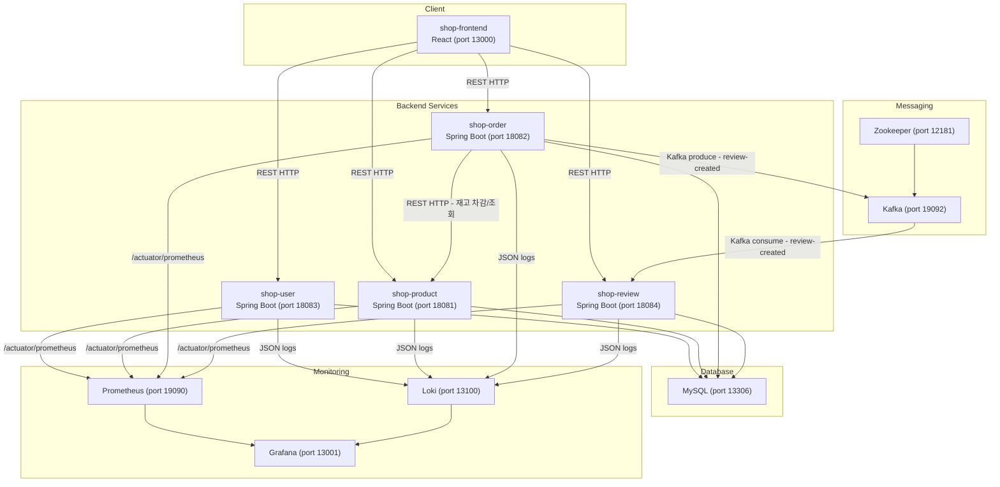
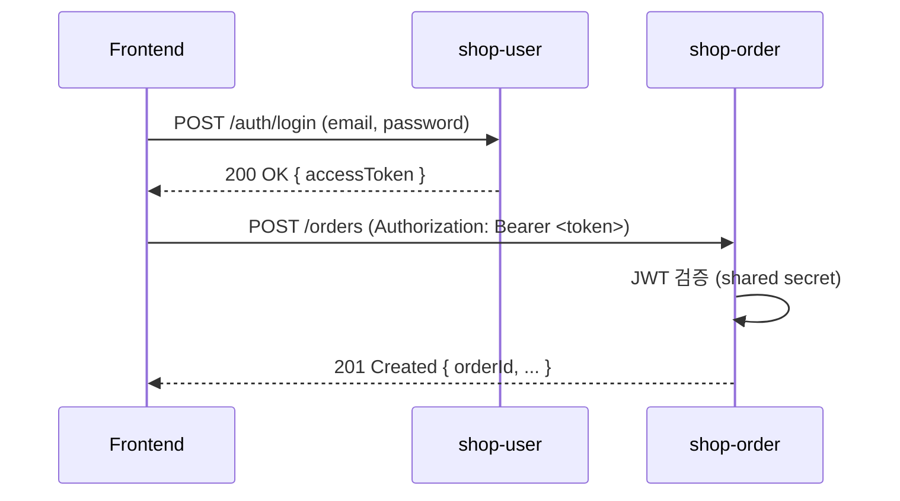
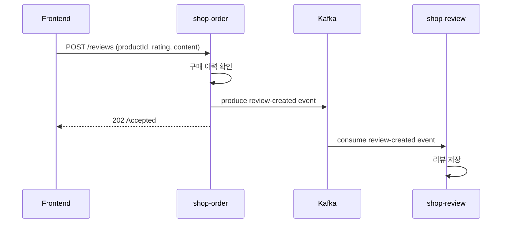

# Design Document: Shopping Mall

## Overview

인프라 관리 연습을 목적으로 하는 마이크로서비스 기반 쇼핑몰 시스템입니다.
React 프론트엔드와 4개의 Spring Boot 백엔드 서비스(User, Product, Order, Review)로 구성되며,
Docker Compose 환경에서 개발 후 로컬 Kubernetes로 이전합니다.

주요 목표:
- 마이크로서비스 간 REST 통신 및 Kafka 비동기 이벤트 처리 실습
- Prometheus + Loki + Grafana 모니터링 스택 구성 실습
- n8n 알람 워크플로우 테스트를 위한 알람 시뮬레이션 엔드포인트 제공

---

## Architecture

### 시스템 아키텍처 다이어그램



### 서비스 기동 순서

```
MySQL → Zookeeper → Kafka → (shop-user, shop-product, shop-review) → shop-order → shop-frontend
```

### 인증 흐름

JWT는 shop-user가 발급하며, 각 서비스가 공유 secret key로 독립적으로 검증합니다.
API Gateway 없이 프론트엔드가 각 서비스에 직접 요청합니다.



### 리뷰 비동기 흐름



---

## Components and Interfaces

### shop-frontend (React, port 13000)

**역할**: 사용자 인터페이스 제공

**UI 테마**: 하늘색(#0EA5E9) 기반 디자인 시스템
- 네비게이션 바: 하늘색 배경 + 흰색 텍스트
- 버튼: 하늘색 배경 + 흰색 텍스트, 호버 시 진한 하늘색
- 상품 카드: 흰색 배경 + 그림자 + 호버 효과
- 전체 배경: 연한 회색(#F0F9FF)

주요 페이지:
- `/` - 상품 목록 (카테고리 필터, 키워드 검색)
- `/products/:id` - 상품 상세 + 리뷰 목록
- `/cart` - 장바구니
- `/orders` - 주문 내역
- `/login`, `/register` - 인증

상태 관리:
- JWT를 localStorage에 저장
- 모든 인증 요청에 `Authorization: Bearer <token>` 헤더 포함

### shop-user (Spring Boot, port 18083)

**역할**: 회원가입, 로그인, JWT 발급

| Method | Path | 인증 | 설명 |
|--------|------|------|------|
| POST | /auth/register | 불필요 | 회원가입 |
| POST | /auth/login | 불필요 | 로그인, JWT 반환 |
| GET | /actuator/prometheus | 불필요 | 메트릭 노출 |
| GET | /simulate/error | 불필요 | 500 에러 시뮬레이션 |
| GET | /simulate/slow | 불필요 | 지연 시뮬레이션 (3000ms+) |
| GET | /simulate/memory | 불필요 | 메모리 할당 시뮬레이션 |

### shop-product (Spring Boot, port 18081)

**역할**: 상품 목록/상세 조회, 재고 관리

| Method | Path | 인증 | 설명 |
|--------|------|------|------|
| GET | /products | 불필요 | 상품 목록 (page, size, category, keyword) |
| GET | /products/:id | 불필요 | 상품 상세 |
| PUT | /products/:id/stock | 서비스 내부 | 재고 차감 (Order_Service 호출) |
| GET | /actuator/prometheus | 불필요 | 메트릭 노출 |
| GET | /simulate/error | 불필요 | 500 에러 시뮬레이션 |
| GET | /simulate/slow | 불필요 | 지연 시뮬레이션 (3000ms+) |
| GET | /simulate/memory | 불필요 | 메모리 할당 시뮬레이션 |

### shop-order (Spring Boot, port 18082)

**역할**: 장바구니, 주문, 리뷰 이벤트 발행

| Method | Path | 인증 | 설명 |
|--------|------|------|------|
| GET | /cart | JWT 필요 | 장바구니 조회 |
| POST | /cart/items | JWT 필요 | 장바구니 상품 추가 |
| PUT | /cart/items/:productId | JWT 필요 | 장바구니 수량 변경 |
| DELETE | /cart/items/:productId | JWT 필요 | 장바구니 상품 삭제 |
| POST | /orders | JWT 필요 | 주문 생성 |
| GET | /orders | JWT 필요 | 주문 내역 조회 |
| POST | /reviews | JWT 필요 | 리뷰 작성 (Kafka produce) |
| GET | /actuator/prometheus | 불필요 | 메트릭 노출 |
| GET | /simulate/error | 불필요 | 500 에러 시뮬레이션 |
| GET | /simulate/slow | 불필요 | 지연 시뮬레이션 (3000ms+) |
| GET | /simulate/memory | 불필요 | 메모리 할당 시뮬레이션 |

### shop-review (Spring Boot, port 18084)

**역할**: 리뷰 저장 (Kafka consumer), 리뷰 조회

| Method | Path | 인증 | 설명 |
|--------|------|------|------|
| GET | /reviews?productId={id} | 불필요 | 상품 리뷰 목록 (page, size) |
| GET | /actuator/prometheus | 불필요 | 메트릭 노출 |
| GET | /simulate/error | 불필요 | 500 에러 시뮬레이션 |
| GET | /simulate/slow | 불필요 | 지연 시뮬레이션 (3000ms+) |
| GET | /simulate/memory | 불필요 | 메모리 할당 시뮬레이션 |

### Kafka 토픽 및 이벤트 스키마

**토픽**: `review-created`
- Partitions: 1 (개발 환경)
- Replication Factor: 1 (단일 브로커)

**이벤트 스키마** (JSON):
```json
{
  "userId": "long",
  "productId": "long",
  "orderId": "long",
  "rating": "int (1~5)",
  "content": "string (max 500)",
  "createdAt": "ISO 8601 datetime string"
}
```

---

## Data Models

### DB 스키마 (MySQL)

각 서비스는 독립적인 DB 스키마를 사용합니다. 단일 MySQL 인스턴스에 서비스별 데이터베이스로 분리합니다.

#### shop_user DB

```sql
CREATE TABLE users (
    id          BIGINT AUTO_INCREMENT PRIMARY KEY,
    email       VARCHAR(255) NOT NULL UNIQUE,
    password    VARCHAR(255) NOT NULL,  -- bcrypt hash
    name        VARCHAR(100) NOT NULL,
    created_at  DATETIME NOT NULL DEFAULT CURRENT_TIMESTAMP
);
```

#### shop_product DB

```sql
CREATE TABLE categories (
    id    BIGINT AUTO_INCREMENT PRIMARY KEY,
    name  VARCHAR(50) NOT NULL UNIQUE  -- 의류, 전자기기, 식품, 생활용품
);

CREATE TABLE products (
    id           BIGINT AUTO_INCREMENT PRIMARY KEY,
    name         VARCHAR(255) NOT NULL,
    description  TEXT,
    price        DECIMAL(10, 2) NOT NULL,
    stock        INT NOT NULL DEFAULT 0,
    category_id  BIGINT NOT NULL,
    image_url    VARCHAR(500),
    created_at   DATETIME NOT NULL DEFAULT CURRENT_TIMESTAMP,
    FOREIGN KEY (category_id) REFERENCES categories(id)
);
```

#### shop_order DB

```sql
CREATE TABLE carts (
    id          BIGINT AUTO_INCREMENT PRIMARY KEY,
    user_id     BIGINT NOT NULL,
    product_id  BIGINT NOT NULL,
    quantity    INT NOT NULL DEFAULT 1,
    UNIQUE KEY uq_cart_user_product (user_id, product_id)
);

CREATE TABLE orders (
    id          BIGINT AUTO_INCREMENT PRIMARY KEY,
    user_id     BIGINT NOT NULL,
    status      VARCHAR(20) NOT NULL DEFAULT '주문완료',
    total_price DECIMAL(10, 2) NOT NULL,
    created_at  DATETIME NOT NULL DEFAULT CURRENT_TIMESTAMP
);

CREATE TABLE order_items (
    id          BIGINT AUTO_INCREMENT PRIMARY KEY,
    order_id    BIGINT NOT NULL,
    product_id  BIGINT NOT NULL,
    product_name VARCHAR(255) NOT NULL,
    price       DECIMAL(10, 2) NOT NULL,
    quantity    INT NOT NULL,
    FOREIGN KEY (order_id) REFERENCES orders(id)
);
```

#### shop_review DB

```sql
CREATE TABLE reviews (
    id          BIGINT AUTO_INCREMENT PRIMARY KEY,
    user_id     BIGINT NOT NULL,
    product_id  BIGINT NOT NULL,
    order_id    BIGINT NOT NULL,
    rating      INT NOT NULL,  -- 1~5
    content     VARCHAR(500) NOT NULL,
    created_at  DATETIME NOT NULL DEFAULT CURRENT_TIMESTAMP,
    INDEX idx_reviews_product_id (product_id)
);
```

### 초기 데이터 (Seed Data)

- `users`: 더미 유저 5개 이상 (bcrypt 해시 비밀번호)
  - 공통 비밀번호: `password123`
  - bcrypt hash: `$2a$10$qW0JCZI4nRW6/z/K0mGTwuf6Qk4P9gsubTbrc2ncs6Lg2QMsk8DAe`
  - 계정: alice@example.com, bob@example.com, carol@example.com, dave@example.com, eve@example.com
- `categories`: 의류, 전자기기, 식품, 생활용품 4개
- `products`: 카테고리별 5개 이상, 총 20개 이상 (picsum.photos URL, 실제 한국 쇼핑몰 스타일 상품명/가격)
- `orders` / `order_items`: 더미 주문 내역

### Docker Compose 구성 개요

```yaml
# 서비스 목록 및 포트 매핑 요약
services:
  shop-frontend:    13000:3000
  shop-user:        18083:8083
  shop-product:     18081:8081
  shop-order:       18082:8082
  shop-review:      18084:8084
  mysql:            13306:3306
  zookeeper:        12181:2181
  kafka:            19092:9092
  prometheus:       19090:9090
  loki:             13100:3100
  grafana:          13001:13001
```

의존성 순서는 `depends_on` + `healthcheck`로 제어합니다:
- `kafka` depends_on `zookeeper`
- Backend services depend_on `mysql`, `kafka`
- `shop-frontend` depends_on backend services

MySQL 초기화: `docker-entrypoint-initdb.d/` 디렉토리에 SQL 파일 마운트

MySQL 한글 인코딩: `command: --character-set-server=utf8mb4 --collation-server=utf8mb4_unicode_ci --init-connect='SET NAMES utf8mb4'`

Grafana 프로비저닝: `provisioning/datasources/` 에 Prometheus, Loki datasource YAML 자동 마운트

### 모니터링 스택 구성

**Prometheus**:
- `prometheus.yml`에 각 서비스 scrape 설정 (15s interval)
- `rules/` 디렉토리에 알람 규칙 파일:
  - `IstioHigh5xxErrorRate`: 5xx 에러율 > 10%
  - `HighMemoryUsage`: JVM 힙 사용률 > 85%
  - `HighLatency`: HTTP p99 응답시간 > 2000ms

**Loki**:
- Promtail 또는 Docker log driver로 JSON 로그 수집
- 각 서비스 컨테이너 로그를 `service` 레이블로 구분

**Grafana**:
- Prometheus, Loki 데이터소스 자동 프로비저닝
- 대시보드 (`shopping-mall-v2`): 7개 패널
  - 패널 1: JVM Heap Memory Usage % (by Service) — percentunit
  - 패널 2: HTTP Request Rate (by Service) — reqps
  - 패널 3: HTTP Response Time p99 (by Service) — seconds, threshold red=2s
  - 패널 4: 5xx Error Rate (by Service) — percentunit, threshold red=0.1
  - 패널 5: JVM G1 Eden Space Usage % (by Service) — percentunit (Minor GC 톱니 패턴 확인)
  - 패널 6: JVM G1 Old Gen Usage % (by Service) — percentunit, threshold orange=0.7/red=0.85
  - 패널 7: Service Logs (Loki) — 전체 서비스 로그, job 레이블 필터링 가능

**구조화 로그 (Logback)**:
- `logstash-logback-encoder` 라이브러리로 JSON 출력
- MDC에 `traceId` 삽입 (HTTP 요청 인터셉터에서 UUID 생성)
- 로그 필드: `timestamp`, `level`, `service`, `traceId`, `message`

### 디렉토리 구조

```
shopping-mall/
├── docker-compose.yml
├── shop-frontend/
│   ├── Dockerfile
│   ├── package.json
│   └── src/
│       ├── App.jsx
│       ├── pages/
│       │   ├── ProductList.jsx
│       │   ├── ProductDetail.jsx
│       │   ├── Cart.jsx
│       │   ├── Orders.jsx
│       │   ├── Login.jsx
│       │   ├── Register.jsx
│       │   └── Admin.jsx        # 어드민: 시뮬레이션 엔드포인트 트리거 UI
│       └── api/           # axios 클라이언트 (user, product, order, review)
├── shop-user/
│   ├── Dockerfile
│   └── src/main/
│       ├── java/com/shop/user/
│       │   ├── controller/  (AuthController, SimulateController)
│       │   ├── service/
│       │   ├── repository/
│       │   ├── entity/
│       │   ├── dto/
│       │   └── config/      (JwtConfig, SecurityConfig)
│       └── resources/
│           ├── application.yml
│           └── logback-spring.xml
├── shop-product/
│   └── src/main/java/com/shop/product/
│       ├── controller/  (ProductController, SimulateController)
│       ├── service/
│       ├── repository/
│       ├── entity/
│       └── dto/
├── shop-order/
│   └── src/main/java/com/shop/order/
│       ├── controller/  (CartController, OrderController, ReviewController, SimulateController)
│       ├── service/
│       ├── repository/
│       ├── entity/
│       ├── dto/
│       ├── kafka/       (ReviewEventProducer)
│       └── client/      (ProductServiceClient - RestTemplate/WebClient)
├── shop-review/
│   └── src/main/java/com/shop/review/
│       ├── controller/  (ReviewController, SimulateController)
│       ├── service/
│       ├── repository/
│       ├── entity/
│       ├── dto/
│       └── kafka/       (ReviewEventConsumer)
├── mysql/
│   └── init/
│       ├── 01-schema.sql
│       └── 02-seed.sql
├── prometheus/
│   ├── prometheus.yml
│   └── rules/
│       └── alerts.yml
├── loki/
│   └── loki-config.yml
└── grafana/
    └── provisioning/
        ├── datasources/
        │   └── datasources.yml
        └── dashboards/
```


---

## Correctness Properties

*A property is a characteristic or behavior that should hold true across all valid executions of a system — essentially, a formal statement about what the system should do. Properties serve as the bridge between human-readable specifications and machine-verifiable correctness guarantees.*

### Property 1: 이메일 중복 등록 거부

*For any* 이메일 주소, 동일한 이메일로 두 번째 회원가입 요청을 하면 HTTP 409 상태코드를 반환해야 한다.

**Validates: Requirements 1.1, 1.3**

### Property 2: 비밀번호 bcrypt 해시 저장

*For any* 유효한 회원가입 요청에서, 저장된 비밀번호는 평문이 아닌 bcrypt 해시 형식이어야 한다.

**Validates: Requirements 1.2**

### Property 3: 유효하지 않은 입력 거부

*For any* 잘못된 이메일 형식 또는 8자 미만 비밀번호를 포함한 회원가입 요청은 HTTP 400 상태코드를 반환해야 한다.

**Validates: Requirements 1.4**

### Property 4: JWT 발급 라운드 트립

*For any* 유효한 사용자 자격증명으로 로그인 시, 반환된 JWT를 디코딩하면 해당 사용자의 userId와 email이 포함되어 있어야 하며, 만료 시간은 발급 시각으로부터 24시간이어야 한다.

**Validates: Requirements 2.1, 2.3, 2.4**

### Property 5: 인증 실패 시 401 반환

*For any* 잘못된 자격증명 또는 유효하지 않은 JWT로 인증이 필요한 API를 호출하면 HTTP 401 상태코드를 반환해야 한다.

**Validates: Requirements 2.2, 2.5**

### Property 6: 상품 목록 페이지네이션

*For any* 페이지 파라미터로 상품 목록을 요청하면, 반환되는 상품 수는 지정된 page size(기본 20개) 이하여야 한다.

**Validates: Requirements 3.1**

### Property 7: 카테고리 필터링 정확성

*For any* 카테고리 파라미터로 상품 목록을 요청하면, 반환된 모든 상품의 카테고리는 요청한 카테고리와 일치해야 한다.

**Validates: Requirements 3.2**

### Property 8: 키워드 검색 정확성

*For any* 검색 키워드로 상품 목록을 요청하면, 반환된 모든 상품의 이름 또는 설명에 해당 키워드가 포함되어야 한다.

**Validates: Requirements 3.3**

### Property 9: 상품 응답 필드 완전성

*For any* 상품 목록 또는 상품 상세 조회 응답에서, 각 상품 객체는 id, name, price, category, stock, imageUrl 필드를 모두 포함해야 한다.

**Validates: Requirements 3.4, 4.1**

### Property 10: 장바구니 추가 라운드 트립

*For any* 로그인한 사용자가 상품을 장바구니에 추가하면, 이후 장바구니 조회 시 해당 상품이 포함되어 있어야 하며 합계 금액이 올바르게 계산되어야 한다.

**Validates: Requirements 5.1, 5.5**

### Property 11: 장바구니 수량 변경 반영

*For any* 장바구니 항목의 수량을 변경하면, 이후 조회 시 변경된 수량이 반영되어야 한다.

**Validates: Requirements 5.3**

### Property 12: 장바구니 삭제 후 미포함

*For any* 장바구니에서 상품을 삭제하면, 이후 조회 시 해당 상품이 포함되지 않아야 한다.

**Validates: Requirements 5.4**

### Property 13: 주문 생성 상태 및 응답 필드

*For any* 로그인한 사용자가 장바구니로 주문을 생성하면, 응답에 orderId, items, totalPrice, createdAt이 포함되어야 하며 주문 상태는 "주문완료"여야 한다.

**Validates: Requirements 6.1, 6.3**

### Property 14: 주문 후 재고 차감

*For any* 주문이 성공적으로 생성되면, Product_Service의 각 상품 재고는 주문 수량만큼 감소해야 한다.

**Validates: Requirements 6.2, 12.1**

### Property 15: 주문 완료 후 장바구니 비우기

*For any* 주문이 성공적으로 완료되면, 해당 사용자의 장바구니는 비어 있어야 한다.

**Validates: Requirements 6.4**

### Property 16: 주문 내역 최신순 정렬 및 필드 완전성

*For any* 로그인한 사용자의 주문 내역 조회 시, 주문 목록은 최신순으로 정렬되어야 하며 각 주문에 orderId, createdAt, status, totalPrice, items가 포함되어야 한다.

**Validates: Requirements 7.1, 7.2**

### Property 17: JSON 로그 형식 및 필드 완전성

*For any* 서비스에서 출력되는 로그 항목은 JSON 파싱이 가능해야 하며, timestamp, level, service, traceId, message 필드를 모두 포함해야 한다.

**Validates: Requirements 9.1, 9.2**

### Property 18: 동일 요청 내 traceId 일관성

*For any* 하나의 HTTP 요청이 여러 서비스를 거칠 때, 해당 요청과 관련된 모든 로그 항목은 동일한 traceId를 포함해야 한다.

**Validates: Requirements 9.5**

### Property 19: 알람 시뮬레이션 엔드포인트 동작

*For any* 서비스(User, Product, Order, Review)의 `/simulate/error` 엔드포인트는 HTTP 500을 반환해야 하고, `/simulate/slow` 엔드포인트는 3000ms 이상 지연 후 응답해야 한다.

**Validates: Requirements 10.1-10.12**

### Property 20: Kafka 리뷰 이벤트 라운드 트립

*For any* 구매 이력이 있는 사용자가 리뷰를 작성하면, Order_Service가 `review-created` 토픽에 이벤트를 발행하고 Review_Service가 이를 수신하여 DB에 저장해야 한다. 이후 해당 상품의 리뷰 목록 조회 시 작성한 리뷰가 포함되어야 한다.

**Validates: Requirements 13.1, 13.2, 13.3**

### Property 21: 리뷰 목록 최신순 정렬 및 페이지네이션

*For any* 상품 ID로 리뷰 목록을 요청하면, 반환된 리뷰는 최신순으로 정렬되어야 하며 각 리뷰에 reviewId, userId, rating, content, createdAt이 포함되어야 하고 반환 수는 page size(기본 20개) 이하여야 한다.

**Validates: Requirements 14.1, 14.2, 14.3**

### Property 22: 장바구니 조회 시 최신 상품 정보 반영

*For any* 장바구니 조회 요청 시, 반환되는 상품 가격과 재고는 Product_Service의 현재 값과 일치해야 한다.

**Validates: Requirements 12.2**

---

## Error Handling

### HTTP 상태코드 규칙

| 상황 | 상태코드 |
|------|---------|
| 유효하지 않은 입력 (형식 오류, 길이 초과 등) | 400 Bad Request |
| 인증 토큰 없음 또는 유효하지 않음 | 401 Unauthorized |
| 권한 없음 (구매 이력 없는 리뷰 등) | 403 Forbidden |
| 리소스 없음 | 404 Not Found |
| 중복 리소스 (이메일 중복, 재고 부족 충돌) | 409 Conflict |
| 의존 서비스 응답 없음 | 503 Service Unavailable |
| 서버 내부 오류 | 500 Internal Server Error |

### 에러 응답 형식

```json
{
  "status": 400,
  "error": "Bad Request",
  "message": "이메일 형식이 올바르지 않습니다",
  "fields": {
    "email": "유효한 이메일 형식이어야 합니다"
  },
  "timestamp": "2024-01-01T00:00:00Z"
}
```

### 서비스 간 통신 장애 처리

- **Product_Service 다운 시**: Order_Service는 503 반환. RestTemplate/WebClient에 타임아웃 설정 (connect: 3s, read: 5s).
- **Kafka 다운 시**: Order_Service는 리뷰 발행 실패 시 503 반환. Kafka producer에 재시도 설정 (retries: 3).
- **MySQL 다운 시**: 각 서비스는 500 반환.

### JWT 검증 실패 처리

각 서비스는 Spring Security Filter Chain에서 JWT를 검증합니다. 검증 실패 시 즉시 401을 반환하며 컨트롤러 레이어에 도달하지 않습니다.

---

## Testing Strategy

### 이중 테스트 접근법

단위 테스트와 속성 기반 테스트를 함께 사용하여 포괄적인 커버리지를 확보합니다.

**단위 테스트 (JUnit 5 + Mockito)**:
- 특정 예시와 에지 케이스 검증
- 서비스 컴포넌트 간 통합 지점 검증
- 에러 조건 및 경계값 검증
- 초기 데이터 존재 여부 검증 (더미 유저 5개 이상, 더미 상품 20개 이상)

단위 테스트 예시:
- 존재하지 않는 상품 ID 조회 시 404 반환
- 재고 0인 상품 품절 상태 표시
- 이미 장바구니에 있는 상품 추가 시 수량 합산
- 재고 초과 수량 요청 시 400 반환
- 구매 이력 없는 사용자 리뷰 작성 시 403 반환
- 평점 범위 외 값 (0, 6) 입력 시 400 반환
- 존재하지 않는 상품 ID로 리뷰 조회 시 빈 목록 + 200 반환

**속성 기반 테스트 (jqwik)**:
- 임의 입력에 대한 보편적 속성 검증
- 각 테스트 최소 100회 반복 실행

### 속성 기반 테스트 설정

사용 라이브러리: **jqwik** (Java용 property-based testing 라이브러리)

```xml
<dependency>
    <groupId>net.jqwik</groupId>
    <artifactId>jqwik</artifactId>
    <version>1.8.x</version>
    <scope>test</scope>
</dependency>
```

각 속성 테스트는 다음 태그 형식으로 주석을 포함해야 합니다:
`// Feature: shopping-mall, Property {number}: {property_text}`

각 테스트는 `@Property(tries = 100)` 어노테이션으로 최소 100회 반복 실행합니다.

### 속성 테스트 구현 예시

```java
// Feature: shopping-mall, Property 7: 카테고리 필터링 정확성
@Property(tries = 100)
void categoryFilterReturnsOnlyMatchingProducts(@ForAll("validCategories") String category) {
    List<ProductResponse> products = productService.getProducts(0, 20, category, null);
    assertThat(products).allMatch(p -> p.getCategory().equals(category));
}
```

### 테스트 범위 요약

| Property | 테스트 유형 | 대상 서비스 |
|----------|------------|------------|
| Property 1 (이메일 중복 거부) | property | shop-user |
| Property 2 (bcrypt 해시) | property | shop-user |
| Property 3 (유효하지 않은 입력 거부) | property | shop-user |
| Property 4 (JWT 발급 라운드 트립) | property | shop-user |
| Property 5 (인증 실패 401) | property | shop-user, shop-order |
| Property 6 (페이지네이션) | property | shop-product |
| Property 7 (카테고리 필터링) | property | shop-product |
| Property 8 (키워드 검색) | property | shop-product |
| Property 9 (상품 응답 필드) | property | shop-product |
| Property 10 (장바구니 추가 라운드 트립) | property | shop-order |
| Property 11 (수량 변경 반영) | property | shop-order |
| Property 12 (삭제 후 미포함) | property | shop-order |
| Property 13 (주문 생성 상태/필드) | property | shop-order |
| Property 14 (주문 후 재고 차감) | property | shop-order + shop-product |
| Property 15 (주문 후 장바구니 비우기) | property | shop-order |
| Property 16 (주문 내역 정렬/필드) | property | shop-order |
| Property 17 (JSON 로그 형식) | property | 전체 서비스 |
| Property 18 (traceId 일관성) | property | 전체 서비스 |
| Property 19 (시뮬레이션 엔드포인트) | property | 전체 서비스 |
| Property 20 (Kafka 리뷰 라운드 트립) | property | shop-order + shop-review |
| Property 21 (리뷰 목록 정렬/페이지) | property | shop-review |
| Property 22 (장바구니 최신 상품 정보) | property | shop-order + shop-product |
| 초기 데이터 존재 여부 | example | shop-user, shop-product, shop-order |
| /actuator/prometheus 엔드포인트 | example | 전체 서비스 |
| 메트릭 항목 포함 여부 | example | 전체 서비스 |

---

## k6 부하 테스트 시나리오

k6를 사용하여 단계별 시나리오를 재현합니다. 각 스크립트는 독립적으로 실행 가능하며, Prometheus 알람 발생 여부로 성공을 판단합니다.

### 디렉토리 구조

```
k6/
├── scenarios/
│   ├── 01-normal-flow.js        # 정상 흐름
│   ├── 02-error-spike.js        # 5xx 에러 혼합 → IstioHigh5xxErrorRate 알람
│   ├── 03-memory-load.js        # 메모리 과부하 → HighMemoryUsage 알람
│   └── 04-latency-spike.js      # 응답 지연 → HighLatency 알람
└── lib/
    └── auth.js                  # 로그인 헬퍼 (JWT 발급)
```

---

### 시나리오 1: 정상 흐름 (01-normal-flow.js)

**목적**: 전체 쇼핑 플로우가 정상 동작하는지 확인. 알람 발생 없어야 함.

**흐름**:
1. 로그인 → JWT 발급
2. 상품 목록 조회 (카테고리 필터, 키워드 검색)
3. 상품 상세 조회
4. 장바구니 추가
5. 주문 생성
6. 주문 내역 조회
7. 리뷰 작성
8. 리뷰 목록 조회

**부하 설정**:
```js
export const options = {
  stages: [
    { duration: '30s', target: 5 },  // 워밍업 (VU 5개로 제한, 계정 5개와 1:1 매핑)
    { duration: '1m',  target: 5 },  // 유지
    { duration: '30s', target: 0 },  // 쿨다운
  ],
  thresholds: {
    http_req_failed: ['rate<0.01'],       // 에러율 1% 미만
    http_req_duration: ['p(95)<1000'],    // p95 응답시간 1초 미만
  },
};
```

**VU별 계정 분산**: `__VU` 인덱스로 alice~eve 5개 계정을 분산 사용하여 장바구니 race condition 방지

**재고 있는 상품 동적 선택**: `stock > 5` 필터로 품절 상품 제외

**성공 기준**: Prometheus 알람 미발생, 에러율 1% 미만

---

### 시나리오 2: 5xx 에러 혼합 (02-error-spike.js)

**목적**: `/simulate/error` 엔드포인트를 정상 요청에 섞어서 `IstioHigh5xxErrorRate` 알람 발생 재현.

**흐름**:
- 70% 요청: 정상 상품 목록 조회
- 30% 요청: `/simulate/error` 호출 (의도적 500 발생)

**부하 설정**:
```js
export const options = {
  scenarios: {
    normal_traffic: {
      executor: 'constant-vus',
      vus: 7,
      duration: '3m',
      exec: 'normalFlow',
    },
    error_traffic: {
      executor: 'constant-vus',
      vus: 3,
      duration: '3m',
      exec: 'errorFlow',
    },
  },
};

export function normalFlow() {
  http.get('http://localhost:18081/products');
  sleep(1);
}

export function errorFlow() {
  // 각 서비스 에러 엔드포인트를 순환 호출
  const services = [
    'http://localhost:18081/simulate/error',  // shop-product
    'http://localhost:18082/simulate/error',  // shop-order
    'http://localhost:18083/simulate/error',  // shop-user
    'http://localhost:18084/simulate/error',  // shop-review
  ];
  http.get(services[Math.floor(Math.random() * services.length)]);
  sleep(1);
}
```

**예상 알람**: `IstioHigh5xxErrorRate` (5xx 에러율 > 10%)

---

### 시나리오 3: 메모리 과부하 (03-memory-load.js)

**목적**: `/simulate/memory` 엔드포인트를 반복 호출하여 JVM 힙 사용률을 85% 이상으로 올려 `HighMemoryUsage` 알람 발생 재현.

**흐름**:
- 대상 서비스를 파라미터로 지정 (기본: shop-product)
- `/simulate/memory`를 짧은 간격으로 반복 호출
- Grafana에서 JVM 힙 사용률 상승 확인

**부하 설정**:
```js
const TARGET_SERVICE = __ENV.SERVICE || 'http://localhost:18081';

export const options = {
  stages: [
    { duration: '30s', target: 5  },  // 점진적 증가
    { duration: '2m',  target: 20 },  // 메모리 압박 유지
    { duration: '30s', target: 0  },  // 쿨다운 (GC 회복 관찰)
  ],
};

export default function () {
  http.get(`${TARGET_SERVICE}/simulate/memory`);
  sleep(0.5);
}
```

**실행 예시**:
```bash
# shop-product 메모리 부하
k6 run -e SERVICE=http://localhost:18081 k6/scenarios/03-memory-load.js

# shop-order 메모리 부하
k6 run -e SERVICE=http://localhost:18082 k6/scenarios/03-memory-load.js
```

**예상 알람**: `HighMemoryUsage` (JVM 힙 사용률 > 85%)

---

### 시나리오 4: 응답 지연 (04-latency-spike.js)

**목적**: `/simulate/slow` 엔드포인트를 정상 요청에 섞어서 `HighLatency` 알람 발생 재현.

**흐름**:
- 60% 요청: 정상 상품 목록 조회
- 40% 요청: `/simulate/slow` 호출 (3000ms+ 지연)

**부하 설정**:
```js
export const options = {
  scenarios: {
    normal_traffic: {
      executor: 'constant-vus',
      vus: 6,
      duration: '3m',
      exec: 'normalFlow',
    },
    slow_traffic: {
      executor: 'constant-vus',
      vus: 4,
      duration: '3m',
      exec: 'slowFlow',
    },
  },
};

export function normalFlow() {
  http.get('http://localhost:18081/products');
  sleep(1);
}

export function slowFlow() {
  const services = [
    'http://localhost:18081/simulate/slow',
    'http://localhost:18082/simulate/slow',
    'http://localhost:18083/simulate/slow',
    'http://localhost:18084/simulate/slow',
  ];
  http.get(services[Math.floor(Math.random() * services.length)]);
  sleep(1);
}
```

**예상 알람**: `HighLatency` (HTTP p99 응답시간 > 2000ms)

---

### 실행 순서 가이드

```bash
# 1. 정상 흐름 확인 (알람 없어야 함)
k6 run k6/scenarios/01-normal-flow.js

# 2. 에러 알람 재현
k6 run k6/scenarios/02-error-spike.js

# 3. 메모리 알람 재현 (서비스 선택 가능)
k6 run -e SERVICE=http://localhost:18081 k6/scenarios/03-memory-load.js

# 4. 레이턴시 알람 재현
k6 run k6/scenarios/04-latency-spike.js
```

### 알람 확인 방법

| 알람 | 확인 위치 | 조건 |
|------|-----------|------|
| IstioHigh5xxErrorRate | Prometheus Alerts 또는 Grafana | 5xx 에러율 > 10%, 1분 지속 |
| HighMemoryUsage | Prometheus Alerts 또는 Grafana | JVM 힙 사용률 > 85%, 2분 지속 |
| HighLatency | Prometheus Alerts 또는 Grafana | HTTP p99 > 2000ms, 1분 지속 |

알람 발생 시 Prometheus AlertManager → Slack → n8n 워크플로우가 트리거됩니다.
